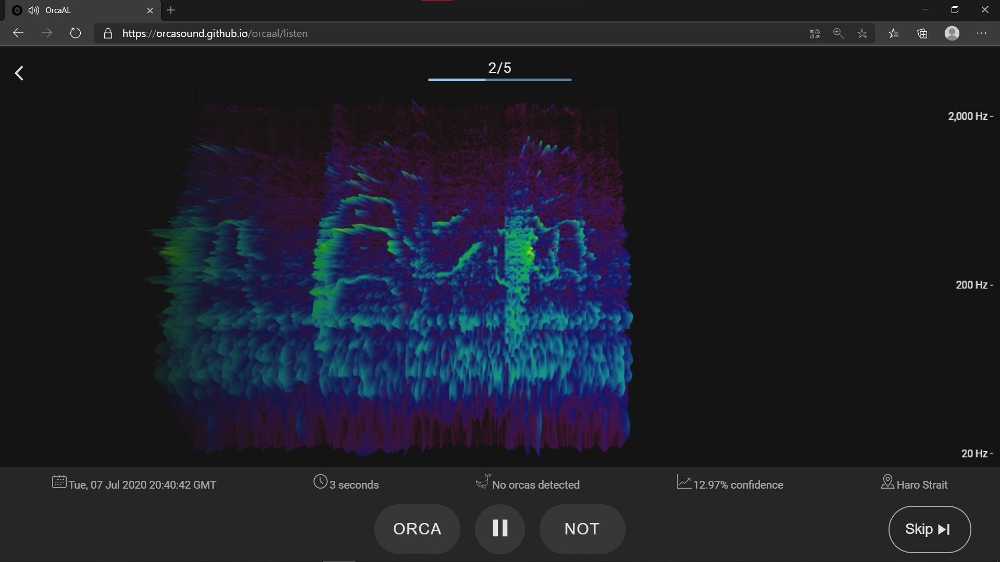

# OrcaAL

> Developed by Diego R. Saltijeral in 2020 and funded by the [Google Summer of Code program](https://summerofcode.withgoogle.com/). The binary classification model and the preprocessing of labeled data were developed by Kunal Mehta; the research about it is located in [this repo](https://github.com/orcasound/orcaal-research).

OrcaAL is an active learning tool that aims to help an orca detection model perform better. You can access it here: https://orcasound.github.io/orcaal/.

This tool is part of the [AI for orcas project](https://www.orcasound.net/portfolio/ai-for-orcas-open-bioacoustic-data-science/), and it aims to solve the problem stated on this [GH issue](https://github.com/orcasound/orcagsoc/issues/2). You can greatly contribute by providing your user experience feedback in this [Google Form](https://forms.gle/oUar3ziijdaR7UGB6), or you can directly add issues [here](https://github.com/orcasound/orcaal/issues).

## How does it work?

A machine learning algorithm can perform better with less training if it is allowed to choose the data from which it learns. Such an algorithm, known as an "active learner" poses queries in the form of unlabeled data instances to be labeled by a human annotator that already understands the nature of the problem.

The tool has been divided into different modules:

-   **A webapp:** it includes an audio player/visualizer and UI for labeling sound clips that our model found confusing. When a goal of N labeled instances has been reached, the model will retrain and learn from the recently annotated clips by calling the API, which then calls the ML Endpoint. Users can also view how the model progresses over time and more detailed statistics after each training round.
-   **An API:** which serves as an interface between the machine learning model and the webapp. Makes use of AWS CLI and PostgreSQL. Both the API and the ML Endpoint are containerized and hosted on AWS Lightsail.
-   **Preprocessing of unlabeled data:** it contains a Python script that generates mp3 files and spectrograms, given a directory containing audio data.
-   **A Machine Learning Endpoint:** which is a small flask app that -- given an h5 file, a labeled dataset and an unlabeled dataset -- trains an ML model on the labeled data and predicts on the unlabeled data.

Go into each directory to learn how to get started with it.

**Flowchart of how the tool works:**  

**Architecture of the tool:**

## Blog posts about the project and GSoC

[My Journey as a Google Summer of Code participant with Orcasound](http://www.orcasound.net/2020/08/26/my-journey-as-a-google-summer-of-code-participant-with-orcasound/)  
[Two months listening and learning about orca sounds](http://www.orcasound.net/2020/08/02/two-months-as-a-gsoc-participant-with-orcasound/)  
[GSoC’s active learning tool: progress after 1 month](http://www.orcasound.net/2020/07/01/gsocs-active-learning-tool-progress-after-1-month/)

## Questions?

Ask GSoC-specific questions in the #GSoC channel of the [Orcasound Slack workspace](https://join.slack.com/t/orcasound/shared_invite/zt-bd1jk2q9-FjeWr3OzocDBwDgS0g1FdQ).

Discuss more general software and hardware development questions within the [Orcasound dev email distribution list](http://lists.orcasound.net/listinfo.cgi/dev-orcasound.net).

More questions about being a GSoC mentor or student? Check out the [GSoC mentor & student guides](https://google.github.io/gsocguides/).

## Open-source tools we used and value:

* [Chrome Experiments (3D spectrogram)](https://musiclab.chromeexperiments.com)
* (Docker](https://github.com/topics/docker)
* (PostgreSQL](https://www.postgresql.org)
* (Flask](https://flask.palletsprojects.com/en/1.1.x/)

